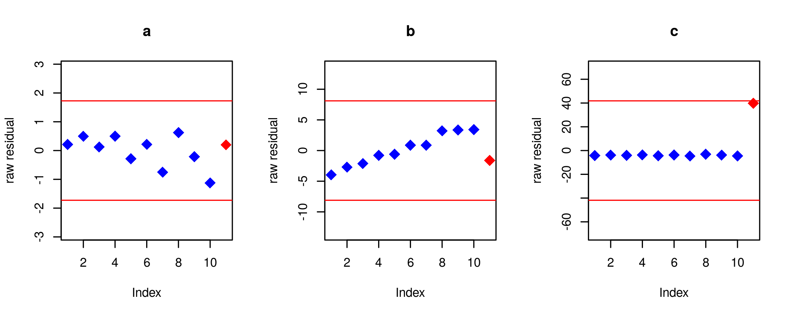
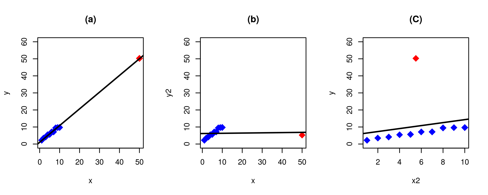
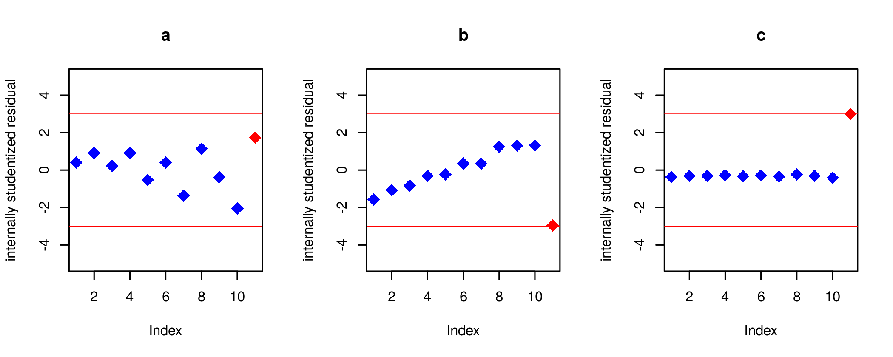
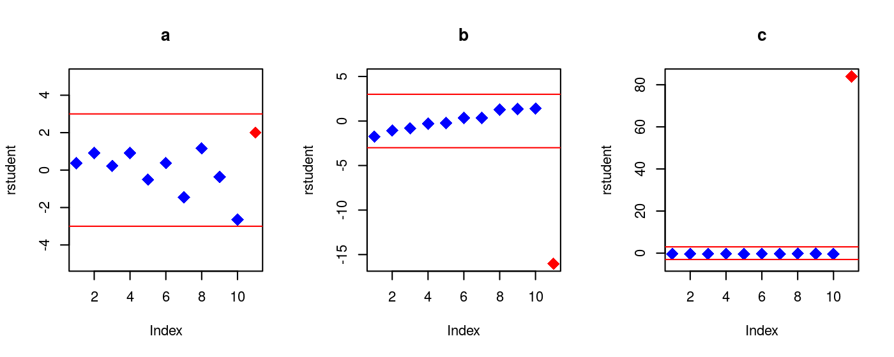
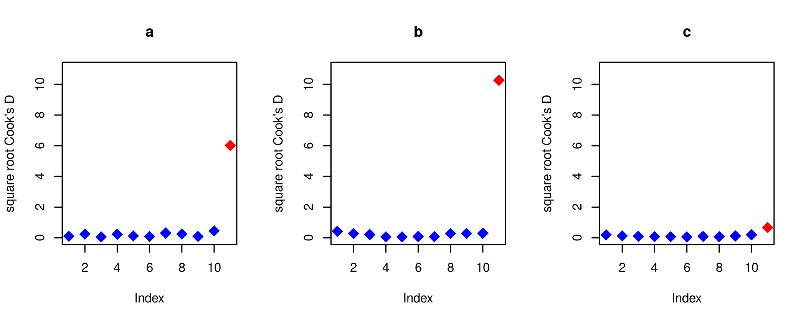

CFRM 420 Autumn 2019
========================================================
author: Nam Lee
date: 
autosize: false
transition: rotate

Chapter 10: rstudent, Cook's D, checking model assumptions (non-normality, non-constant variance, and non-linearity)

Chapter 11: Parametric non-linear regression


$\newcommand{\eps}{\varepsilon}$
$\newcommand{\Var}{\operatorname{Var}}$
$\newcommand\Cov{\operatorname{Cov}}$
$\newcommand{\sig}{\sigma}$
$\newcommand{\al}{\alpha}$
$\newcommand{\Xb}{\bar{X}}$
$\newcommand{\Yb}{\bar{Y}}$
$\newcommand\Eb{\mathbb{E}}$
$\newcommand\Pb{\mathbb{P}}$
$\newcommand\Qb{\mathbb{Q}}$
$\newcommand\Rb{\mathbb{R}}$
$\newcommand\Zb{\mathbb{Z}}$
$\newcommand\Nb{\mathbb{N}}$
$\newcommand\Av{\textbf{A}}$
$\newcommand\Fv{\textbf{F}}$
$\newcommand\Gv{\textbf{G}}$
$\newcommand\Hv{\textbf{H}}$
$\newcommand\Kv{\textbf{K}}$
$\newcommand\Iv{\textbf{I}}$
$\newcommand\Pv{\textbf{P}}$
$\newcommand\Sv{\textbf{S}}$
$\newcommand\Xv{\textbf{X}}$
$\newcommand\Yv{\textbf{Y}}$
$\newcommand\Zv{\textbf{Z}}$
$\newcommand\av{\mathbf{a}}$
$\newcommand\xv{\mathbf{x}}$
$\newcommand\yv{\mathbf{y}}$
$\newcommand\zv{\mathbf{z}}$
$\newcommand\Cv{\mathbf{C}}$
$\newcommand\mv{\mathbf{m}}$
$\newcommand\nv{\mathbf{n}}$
$\newcommand\pv{\mathbf{p}}$
$\newcommand\sv{\mathbf{s}}$
$\newcommand\wv{\mathbf{w}}$
$\newcommand\Wv{\textbf{W}}$
$\newcommand\betav{{\boldsymbol\beta}}$
$\newcommand\etav{{\boldsymbol\eta}}$
$\newcommand\epsv{{\boldsymbol\varepsilon}}$
$\newcommand\delv{{\boldsymbol\delta}}$
$\newcommand\Lamv{{\boldsymbol\Lambda}}$
$\newcommand\lamv{{\boldsymbol\lambda}}$
$\newcommand\muv{{\boldsymbol\mu}}$
$\newcommand\piv{{\boldsymbol\pi}}$
$\newcommand\Pbh{\widehat{\Pb}}$
$\newcommand\Ebh{\widehat{\Eb}}$
$\newcommand\Qh{\widehat{Q}}$
$\newcommand\Ih{\widehat{I}}$
$\newcommand\pih{\widehat{\pi}}$
$\newcommand\Pih{\widehat{\Pi}}$
$\newcommand\Wh{\widehat{W}}$
$\newcommand\Fh{\widehat{F}}$
$\newcommand\Yh{\widehat{Y}}$
$\newcommand\Yvh{\widehat{\Yv}}$
$\newcommand\Ah{\widehat{\Ac}}$
$\newcommand\uh{\widehat{u}}$
$\newcommand\vh{\widehat{v}}$
$\newcommand\fh{\widehat{f}}$
$\newcommand\hh{\widehat{h}}$
$\newcommand\Bh{\widehat{B}}$
$\newcommand\rhoh{\widehat{\rho}}$
$\newcommand\nuh{\widehat{\nu}}$
$\newcommand\varphih{\widehat{\varphi}}$
$\newcommand\thetah{\widehat{\theta}}$
$\newcommand\betah{\widehat{\beta}}$
$\newcommand\betavh{\widehat{\boldsymbol\beta}}$
$\newcommand\kaph{\widehat{\kappa}}$
$\newcommand\sigh{\widehat{\sigma}}$
$\newcommand\epsh{\widehat{\eps}}$
$\newcommand\epsvh{\widehat{\epsv}}$


Finding an outlier from residuals 
========
* Under ideal circumstances, the "raw" residuals 
$$
\epsh_n = Y_n - \Yh_n
$$ 
are approximately i.i.d. $N(0,\sig_{\eps}^2)$.  
* So, Under ideal circumstances,  the condition $|\epsh_n| > 3\sig_{\eps}$ can detect residual outliers? 




Residuals at high leverage points 
======

* Residual outlier at high-leverage points are not detectable by looking at raw residuals. The problem is that such residuals have small size




Two approaches 
========

* Internally Studentized Residuals

$$
\begin{align}
\frac{\epsh_n}{\sigh_\eps\sqrt{1-H_{nn}}}
\end{align}
$$

* Externally Studentized Residuals (rstudent)

$$
\begin{align*}
   \text{rstudent}_n := \frac{\epsh_n}{\sigh_{\eps,(-n)}\sqrt{1-H_{nn}}}
\end{align*}
$$

Here, $\sigh_{\eps,(-n)}$ is the residual standard error for a regression model which uses all but the n-th observation $(X_{n,1},\dots,X_{n,p}, Y_n)$

Key Ideas of Studentized Residuals
=============
* To account for the small size of $\epsh_n$ at high-leverage points, we "studentize" the residuals by dividing by their standard error:

$$
\begin{align}
\Cov\left(\epsvh\right) 
& = \Cov\left(\Yv - \Yvh\right)\\
& = \Cov\left(\Yv - H \Yv\right)\\
& = (I-H)\Cov\left(\Yv\right)(I-H)^\top \\
& = \sig^2_\eps(I-H)(I-H)^\top \\
& = \sig^2_\eps(I-H)
\end{align}
$$

* Internally studentized residuals have a problem: a residual outlier inflates $\sigh_\eps^2$, which makes internally studentized residuals to be small. 


Does it work?
=============




Cook's distance (Cook's D)
=========================
type: section 


Cook's distance (Cook's D)
=========================

* Leverage and rstudent can indicate potential problems. 
* How much influence an observation has on estimates? 
* This information can be obtained by Cook's D
$$
\begin{align*}
    \text{Cook's D}_n := \frac{\sum_{k=1}^N \left(\Yh_k - \Yh_k(-n)\right)^2}{\sigh_\eps^2(p+1)}
\end{align*}
$$
where $\Yh_k(-n)$ is the $k$-th fitted value using $\betah$ that are estimated with the $n$-th observation excluded


High Influence Points 
===================

* Cook's D measures how much (on average) the fitted values change if an observation is deleted
* It directly measures the influence of an observation
* Observations with high Cook's D are called "high-influence" points (or observations)
* To find high influence points, find outliers in Cook's D


```r
sqrt(cooks.distance(model))
```

Cook's D Example 
================

* To detect high influence points, we can use the half-normal plots of the square root of Cook's D statistics
* A half-normal plot is a good graphical tool to detect outliers in a sample



Half-Normal plots
==================

* A half-normal plot is the QQ plot of the sample quantiles of the absolute value of a sample against the quantile of  $|Z|$, where  $Z\sim N(0,1)$
* The main use of half-normal plots is to detect outliers, not to compare distributions
* Look for points that are "detached" from the rest of the sample
* Non-linearity does not matter


```r
library(faraway) 
halfnorm(sqrt(cooks.distance(model_a)))
```


Half-Normal plots in R 
==================


```
Error in library(faraway) : there is no package called 'faraway'
```
